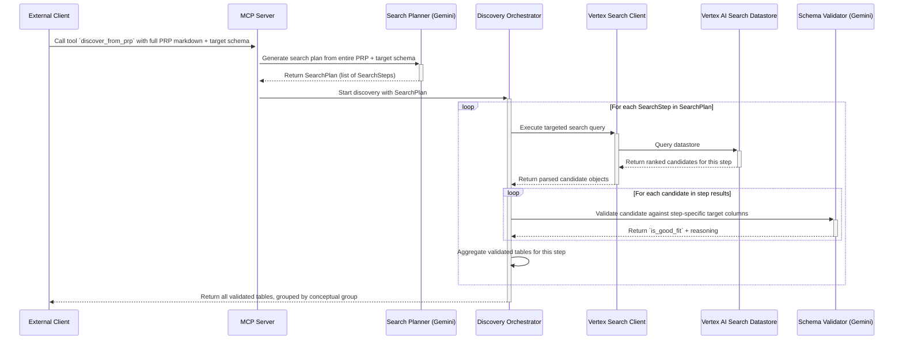

# Data Discovery Agent: Strategy-Driven Discovery Workflow

This document provides a detailed, step-by-step breakdown of the internal data flow within the Data Discovery Agent. It follows the journey from an initial request containing a high-level business requirement to the final output of validated, relevant source datasets.

## Architectural Principles

The agent's design is centered on a **strategy-driven, multi-query approach**. Rather than attempting to find all required data with a single broad search query (which leads to "context collapse"), the system:

1. **Plans**: Analyzes the entire PRP to break down the overall requirement into distinct conceptual groups of data.
2. **Executes**: Performs targeted semantic searches for each conceptual group.
3. **Validates**: Uses context-aware validation to assess each candidate against only the specific columns relevant to that conceptual group.

This approach prevents valuable partial sources from being incorrectly rejected and improves the precision of discovered datasets.

---

## End-to-End Data Flow



### **Phase 1: Strategic Planning**

1. **Entry Point**: The process begins when an external client sends a request to the agent's **MCP Server**. The request invokes the `discover_from_prp` tool.
2. **Payload**: The input includes:
   - The entire **Product Requirement Prompt (PRP)** markdown document
   - The **target schema** (extracted from Section 9 by the client or provided directly)
3. **Plan Generation**: The server passes both the full PRP and target schema to the **Search Planner**. This component uses an LLM (Gemini Flash) to:
   - Analyze the entire PRP to understand the business context, not just Section 9
   - Identify distinct **conceptual groups** of data required (e.g., "game metadata", "model predictions", "actual results")
   - Generate a **targeted semantic search query** for each conceptual group
   - Map each query to the **specific subset of columns** from the target schema that the query aims to discover

4. **Output**: The Search Planner returns a structured `SearchPlan` containing multiple `SearchStep` objects, each with:
   - `conceptual_group`: A description of what type of data this step targets
   - `search_query`: A focused, one-sentence semantic query
   - `target_columns_for_validation`: The specific columns to validate against for this step

### **Phase 2: Targeted Execution**

1. **Orchestration**: The `SearchPlan` is forwarded to the **Discovery Orchestrator**, which executes the multi-step search strategy.
2. **Iterative Searching**: For each `SearchStep` in the plan:
   - The orchestrator sends the step's targeted `search_query` to the **Vertex Search Client**
   - The client queries the **Vertex AI Search Datastore** with this focused query
   - The datastore returns a ranked list of candidate tables whose metadata semantically matches this specific query
3. **Client Disconnection Detection**: The orchestrator checks if the client is still connected between steps. If the client has disconnected, it cancels the remaining work to avoid wasting resources.

### **Phase 3: Context-Aware Validation**

1. **Parsing**: The **Vertex Search Client** receives the raw results from the API and parses them into standardized data objects.
2. **Targeted Validation**: For each candidate returned by the current search step:
   - The **Discovery Orchestrator** calls the **Schema Validator**
   - The validator is given:
     - The full schema of the candidate source table
     - Only the **specific columns** relevant to this conceptual group (from `target_columns_for_validation`)
     - The `conceptual_group` description for context
3. **Fitness Assessment**: The Schema Validator uses an LLM (Gemini Flash) to:
   - Compare the candidate's schema against only the subset of required columns for this step
   - Determine if the candidate is a good fit for providing this specific type of data
   - Return a boolean `is_good_fit` and detailed reasoning
4. **Aggregation**: Validated candidates from each step are grouped by their `conceptual_group` and aggregated into the final results.

### **Output**

The orchestrator returns a list of discovery results, with each entry representing one `SearchStep`:

```json
{
  "conceptual_group": "Game Identification and Timing",
  "search_query": "NFL game identifiers with dates, weeks, years, and team matchups",
  "target_columns": [
    {"name": "game_id", "type": "string", "description": "..."},
    {"name": "game_date", "type": "date", "description": "..."}
  ],
  "discovered_tables": [
    {
      "table_id": "backtest_regression_inferences",
      "project_id": "...",
      "dataset_id": "...",
      "description": "...",
      "schema": [...],
      "relevance_score": 0.95
    }
  ]
}
```

This structured output clearly shows which tables were found for each conceptual requirement, making it easier for downstream systems (like the query generation agent) to understand which sources provide which types of data.
